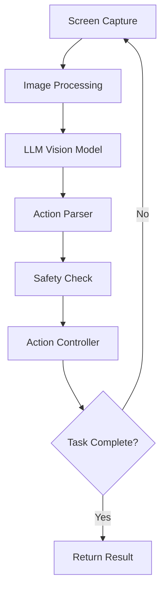

# Odin 🔱

AI-powered computer automation agent using vision LLMs.

## Architecture



## Features

- **ReAct Loop**: Reason + Act pattern for intelligent automation
- **Vision LLM**: Uses OpenRouter to access GPT-4V, Claude 3, Gemini, etc.
- **PyAutoGUI Actions**: Click, type, scroll, hotkeys, and more
- **Safety Layer**: Rate limiting, bounds checking, dangerous action detection
- **Memory**: Tracks conversation history and executed actions

## Installation

```bash
# Clone the repo
git clone https://github.com/your-username/odin.git
cd odin

# Install with uv
uv sync
```

## Setup

1. Get an API key from [OpenRouter](https://openrouter.ai/)
2. Set the environment variable:

```bash
export OPENROUTER_API_KEY="your-api-key"
```

3. Grant permissions (macOS):
   - **Screen Recording**: System Settings → Privacy & Security → Screen Recording
   - **Accessibility**: System Settings → Privacy & Security → Accessibility

## Usage

```python
from odin import Agent, create_client

# Create LLM client
llm = create_client(model="google/gemini-2.0-flash-001")

# Create agent
agent = Agent(llm)

# Run a task
result = agent.run("Open Safari and search for 'weather today'")

print(f"Success: {result.success}")
print(f"Message: {result.message}")
print(f"Steps: {result.total_steps}")
```

## Configuration

```python
from odin import Agent, AgentConfig
from odin.action.safety import SafetyConfig

config = AgentConfig(
    max_steps=50,           # Max steps before stopping
    step_delay=0.5,         # Delay between steps
    use_grid=True,          # Overlay grid on screenshots
    grid_step=100,          # Grid cell size in pixels
    safety=SafetyConfig(
        max_actions_per_minute=60,
        min_action_delay=0.1,
    ),
)

agent = Agent(llm, config=config)
```

## Project Structure

```
src/odin/
├── agent/           # ReAct loop agent
│   ├── core.py      # Main agent class
│   ├── memory.py    # Conversation/action history
│   └── parser.py    # LLM response parser
├── action/          # GUI automation
│   ├── controller.py # PyAutoGUI actions
│   └── safety.py    # Safety checks
├── llm/             # LLM integration
│   ├── client.py    # OpenRouter client
│   └── prompts.py   # System prompts
└── perception/      # Screen capture
    ├── screen.py    # Screenshot capture
    └── processing.py # Image processing
```

## License

MIT
