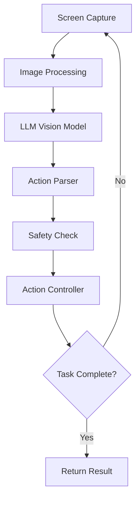

<p align="center">
  
  <br>
  <em>AI-powered computer automation agent using vision LLMs.</em>
  <br><br>
  <a href="https://opensource.org/licenses/MIT"></a>
  

## Demo


## Architecture


```mermaid
graph TD
    A[Screen Capture] --> B[Image Processing]
    B --> C[LLM Vision Model]
    C --> D[Action Parser]
    D --> E[Safety Check]
    E --> F[Action Controller]
    F --> G{Task Complete?}
    G -->|No| A
    G -->|Yes| H[Return Result]
```

## Features

- **ReAct Loop**: Reason + Act pattern for intelligent automation
- **Vision LLM**: Supports optional OpenRouter and AWS Bedrock providers
- **macOS Accessibility Context**: Sends a compact AX tree alongside screenshots
- **Element Actions**: Press, click, focus, set text, and scroll by accessibility ID
- **CoreGraphics Fallbacks**: Coordinate click, type, scroll, hotkeys, and more
- **Safety Layer**: Rate limiting, bounds checking, dangerous action detection
- **Memory**: Tracks conversation history and executed actions

## Installation

```bash
# Clone the repo
git clone https://github.com/your-username/odin.git
cd odin

# Install with uv and your preferred LLM provider extra
uv sync --extra openrouter
# or
uv sync --extra bedrock
```

## Setup

1. Install an LLM provider extra. For OpenRouter:

```bash
uv sync --extra openrouter
```

2. Get an API key from [OpenRouter](https://openrouter.ai/) and set it:

```bash
export OPENROUTER_API_KEY="your-api-key"
```

For AWS Bedrock instead, install the optional extra and use standard AWS SDK
credentials:

```bash
uv sync --extra bedrock
export ODIN_LLM_PROVIDER=bedrock
export AWS_REGION="us-east-1"
```

Then pass a Bedrock model ID when needed:

```bash
uv run python -m odin "Open Safari" --provider bedrock --model us.anthropic.claude-opus-4-7
```

3. Grant permissions (macOS):
   - **Screen Recording**: System Settings → Privacy & Security → Screen Recording
   - **Accessibility**: System Settings → Privacy & Security → Accessibility

## Usage

```python
from odin import Agent, create_client

# Create LLM client after installing odin[openrouter]
llm = create_client(model="google/gemini-2.0-flash-001")

# Or use AWS Bedrock after installing odin[bedrock]
llm = create_client(provider="bedrock", model="us.anthropic.claude-opus-4-7")

# Create agent
agent = Agent(llm)

# Run a task
result = agent.run("Open Safari and search for 'weather today'")

print(f"Success: {result.success}")
print(f"Message: {result.message}")
print(f"Steps: {result.total_steps}")
```

## macOS App Shell

Odin includes a SwiftUI development app with a minimal Spotlight-style chat
window. Provider, model, API key, AWS region, and local runtime settings live in
the Odin menu bar icon:

```bash
cd apps/macos/OdinApp
swift run OdinApp
```

The app stores provider keys in macOS Keychain and launches the Python agent via
`python -m odin.app_runner`, which streams structured JSONL events back to the
compact status line.

## Configuration

```python
from odin import Agent, AgentConfig
from odin.action.safety import SafetyConfig

config = AgentConfig(
    max_steps=100,          # Max steps before stopping
    step_delay=0.5,         # Delay between steps
    use_accessibility=True, # Include macOS accessibility tree context
    max_batch_actions=5,    # Max actions accepted per LLM call
    safety=SafetyConfig(
        max_actions_per_minute=60,
        min_action_delay=0.1,
    ),
)

agent = Agent(llm, config=config)
```

## Accessibility

On macOS, Odin captures the focused app/window accessibility tree and sends a
compact element list to the model alongside the screenshot. Elements include IDs,
roles, labels, values, frames, focus state, and native AX actions when available.

The model can use element-based actions:

```json
{"thought": "The Submit button is visible.", "actions": [{"action": "press_element", "params": {"element_id": "ax_12"}}]}
```

Supported element actions include `click_element`, `double_click_element`,
`press_element`, `focus_element`, `set_text`, and `scroll_element`. Odin tries
native AX actions first where possible and falls back to the element frame center
using Quartz mouse/keyboard events when appropriate.

## Tracing

Odin can write structured JSONL traces for each agent run:

```bash
uv run python -m odin "Open Safari" \
  --trace-path .traces/run.jsonl \
  --trace-screenshots
```

Trace events include run lifecycle, screenshot capture, LLM request/response,
parse results, safety decisions, action execution, failures, token usage, and
final result metadata. `--trace-screenshots` saves PNG artifacts next to the
trace file.

For Bedrock, Odin records `usage.inputTokens`, `usage.outputTokens`, and
`usage.totalTokens` from the Converse response. Estimated USD cost is included
when token prices are configured. Claude Opus 4.7 standard rates are built in
for `anthropic.claude-opus-4-7` and its `us.`, `eu.`, `jp.`, `au.`, and
`global.` inference profile IDs. Override rates for a specific model, region,
or tier when needed:

```bash
export ODIN_BEDROCK_INPUT_COST_PER_1K_TOKENS="0.005"
export ODIN_BEDROCK_OUTPUT_COST_PER_1K_TOKENS="0.025"
```

Use the current AWS Bedrock pricing page for the model and region you run.

To inspect the exact system prompt sent to the model:

```bash
uv run python -m odin --show-system-prompt
```

Odin expects batch-style model responses by default. Even one action is returned
inside an `actions` array, and `--max-batch-actions` limits the accepted batch
size:

```bash
uv run python -m odin "Open Safari" --max-batch-actions 5
```

## Project Structure

```
src/odin/
├── agent/           # ReAct loop agent
│   ├── core.py      # Main agent class
│   ├── memory.py    # Conversation/action history
│   ├── parser.py    # LLM response parser
│   └── tracing.py   # Structured JSONL tracing
├── action/          # GUI automation
│   ├── controller.py # Quartz backend GUI actions
│   └── safety.py    # Safety checks
├── llm/             # LLM integration
│   ├── base.py      # Provider protocol and response types
│   ├── factory.py   # Provider selection and client construction
│   ├── providers/   # Optional provider implementations
│   │   ├── openrouter.py
│   │   └── bedrock.py
│   └── prompts.py   # System prompts
└── perception/      # Screen capture
    ├── accessibility.py # macOS AX tree capture and element lookup
    ├── screen.py    # Screenshot capture
    └── processing.py # Image processing
```

## License

MIT
